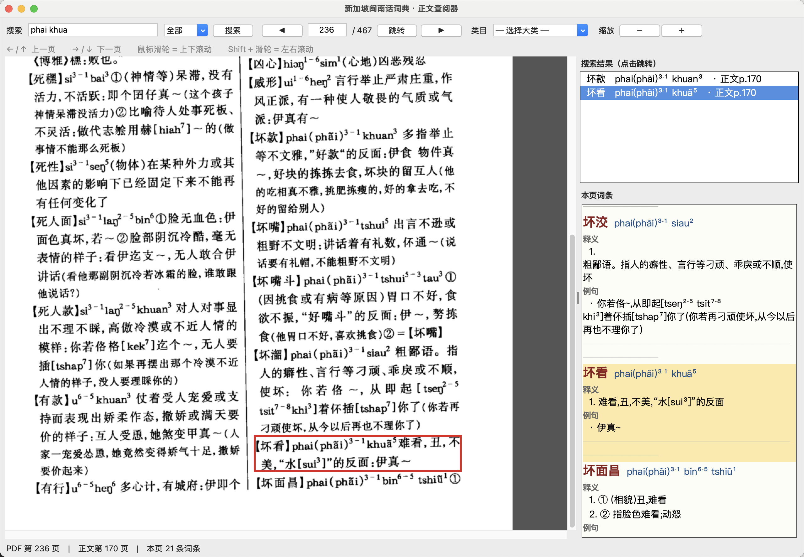

# 新加坡闽南话词典 OCR 数字化文本
> 《新加坡闽南话词典》｜周长楫、周清海 著｜2002 中国社会科学出版社


你可以在这个 url 查看 pdf 原版： https://toaz.info/doc-view-4

## 📖 项目介绍

本项目把扫描版《新加坡闽南话词典》OCR 成可检索、可复制的机器可读文本，方便搜索查找。

原书记录新加坡闽南话（新加坡福建话），收录了大量南洋本土特色词汇，采用国际音标+数字调号记录新加坡闽南口语。

> OCR 文本存在识别误差，引用前请核对原书。


## 📂 仓库内容

OCR 按书的四个部分处理，每部分都有**逐页单文件**（`*_pages/`），最后**合并为一个整文件**（`dictionary_ocr/`）：

| 部分 | 扫描页范围  | 合并文件 |
|------|-----------|----------|
| 前言·序论 | 第 6–57 页 | `dictionary_ocr/1_前言.md` |
| 凡例 | 第 58–66 页 | `dictionary_ocr/2_凡例.md` |
| 词典正文 | 第 67–366 页（300 页） | `dictionary_ocr/3_词典正文.txt` 与 `.bbox.json` |
| 检索表说明 | 检索表首页  | `dictionary_ocr/4_检索表说明.md` |
| 音序检索表 | 第 378–462 页 | `dictionary_ocr/4_检索表.txt` |

- `dictionary_ocr/`：合并后的整份文本，日常查阅只看这里就够了。
- `src/`：封面图和原书 PDF。
- `方言字.md`：记录原文中会被错误识别的方言字。

### 词典正文（TXT）

采用轻量的纯文本格式，直接就是人类可读的词典排版。每条词条形如：

```
【日】  [lit(dzit)⁸]
① 太阳：出～｜～落
② 昼夜：一～
③ 白天：～班 ▲无暝无日（没日没夜，形容时间长）
④ 指一段时间：往～
⑤ 每天的：～记

【日头】  [lit(dzit)⁸⁻⁵ thau²]
太阳：～光（阳光）‖民间有人以"日"为阳性，"月"为阴性…
例：好天 [ho²¹ tʰi⁵⁵] 好天气
```

约定：

- **词头行**：以 `【词】` 开头，两个空格，接 `[音标]`；多个可选读音用 ` / ` 分隔。
- **释义行**：跟在词头行下面（不留空行），单义直接一行，多义用 `① ② ③ …` 起头。
- **例句行**：以 `例：` 开头。
- **章节标题**：`# 大类` （如 `# 天文地理`），`## （N）小节`（如 `## （1）天文`）。
- **页码标记**：`<!-- page NNN -->` 标示扫描 PDF 的第 NNN 页，用于溯源。原书正文页码 = PDF 页码 − 66。
- **词条之间**空一行；同一词条内部（词头 + 释义 + 例句）不留空行。

### 词条定位数据（bbox.json）

`dictionary_ocr/3_词典正文.bbox.json` 保存每个词条在扫描图上的归一化坐标（相对图宽/高 0–1），供查阅器画高亮框：

```json
{
  "meta": {"pages": 297, "total_entries": 5816},
  "pages": {
    "67": {
      "image": {"w": 932, "h": 1416},
      "entries": [
        {"idx": 0, "hw": "日", "ipa": "lit(dzit)⁸",
         "bbox": [0.069, 0.302, 0.478, 0.389]}
      ]
    }
  }
}
```

- 坐标由 GPT-6 模型生成，不保证像素级精确但足够定位。
- 未能生成 bbox 的 3 页（090 / 340 / 365）均为无词条页（跨页续写正文或索引前言）。

### 检索表（TSV）

一行一条，`音标 ⇥ 汉字词条 ⇥ 页码` 三列以 TAB 分隔：

```
a¹	阿	297
a¹ baŋ⁵ a¹ leh⁸	阿网阿咧	64
```

用它可以从音标反查词条所在页（页码为原书正文页码）。

### 注音体例

原书用国际音标（IPA）加上标数字标声调，如 `kʰa⁵⁵`、`tʰi⁵³`、`bin¹ hua³³`。OCR 结果保留了这套写法，查词、检索时直接带上标字符（⁰¹²³⁴⁵⁶⁷⁸⁹）匹配即可。

## 🔍 双版查阅工具

### A. 桌面版 `dict_viewer.py`（tkinter GUI）

将 PDF 原页和词典正文（TXT）对照展示，查起来比翻文件方便：



> 上图演示：搜索框输入 `phai khua`（发音模糊匹配，可省声调），
> 右上搜索结果面板命中【坏款】【坏看】；点击【坏看】后自动跳到 PDF 第 236 页，
> 左侧 PDF 上用红框标出词条位置，右下本页词条面板同步黄底高亮。
> 底部状态栏同时显示 PDF 页码、原书正文页码、本页词条数。

```bash
cd dict_output
python3 dict_viewer.py
```

- 左侧显示 PDF 页面（可翻页、跳转页码、缩放），右侧显示该页解析出的词条（词头、音标、释义、例句），并标出所属的大类/小节。
- **点击右侧词条 → 左侧 PDF 上自动画红框定位**（数据来源 `3_词典正文.bbox.json`）。
- 工具栏可按 **词条 / 发音 / 释义 / 例句** 搜索，点击搜索结果即跳到对应 PDF 页并高亮该词条。
- 发音搜索为模糊匹配：不用输入声调（上标数字可省略），鼻化韵也不用管——`apa` 能查到 `a¹ pa⁶`（阿爸），`tshi` 能查到 `tshĩ⁵⁵`。
- 支持键盘 ←/↑ 前页、→/↓ 后页；鼠标滑轮在 PDF 上可上下滚动，Shift + 滑轮左右滚动。
- 依赖：`tkinter`、`PyMuPDF`、`Pillow`（无图形界面的服务器可用 `Xvfb` 或本地 X11 转发运行）。
- 自检：`python3 dict_viewer.py --selftest` 可在无界面环境下验证数据加载与搜索逻辑。

### B. 网页版 `index.html`（零依赖）

一个单页应用，功能与桌面版基本对齐：左 PDF 页、右词条 + 搜索，点击词条高亮。运行前先把页面图片准备好：

```bash
# 本地开发：软链接（即时、不占空间）
python3 prepare_web.py

# 本地预览
cd dict_output && python3 -m http.server 8000
# 浏览器打开 http://localhost:8000/
```

**零构建、零依赖**：HTML 中所有解析、搜索、高亮逻辑都是纯前端 JavaScript。


## ⚠️ 质量说明

- 文本由视觉模型整页识别生成，未做逐页人工校对，存在错字、漏字、栏序错乱的可能。
- 跨页词条已在识别时联动下一页减少截断，但仍不能保证 100% 完整。
- 音标中的特殊字符（ʰ ʔ ŋ ɔ ə 等）和鼻化韵（例如：ã）是识别难点，个别位置可能有偏差；涉及引用务必对照原书。
- 词条 bbox 由 vision 模型输出，密集短条目页可能出现少量框位偏移或堆叠。
- 发现错误欢迎提 issue / PR 修正，校对请以原版书籍（见上方链接）为依据。
