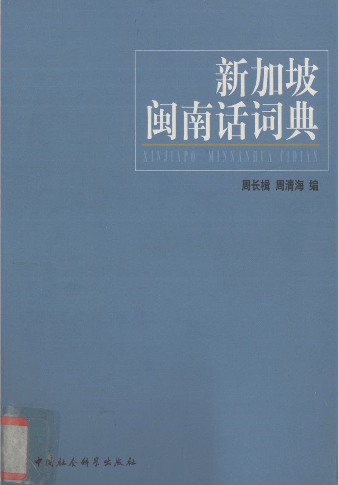

# 新加坡闽南话词典 OCR 数字化文本
> 《新加坡闽南话词典》｜周长楫、周清海 著｜2002 中国社会科学出版社



你可以在这个 url 查看 pdf 原版： https://toaz.info/doc-view-4

## 📖 项目介绍

本项目把扫描版《新加坡闽南话词典》OCR 成可检索、可复制的机器可读文本，方便搜索查找。

原书记录新加坡闽南话（新加坡福建话），收录了大量南洋本土特色词汇，采用国际音标+数字调号记录新加坡闽南口语。

> OCR 文本存在识别误差，引用前请核对原书。


## 📂 仓库内容

OCR 按书的四个部分处理，每部分都有**逐页单文件**，最后**合并单个文件，得到整份文本**：

| 部分 | 扫描页范围 | 对应文件 |
|------|-----------|----------|
| 前言·序论 | 第 6–57 页（52 页） | `dictionary_ocr/1_前言.md` |
| 凡例 | 第 58–66 页（5 页） | `dictionary_ocr/2_凡例.md` |
| 词典正文 | 第 67–366 页（300 页） | `dictionary_ocr/3_词典正文.yaml` |
| 音序检索表 | 第 378–462 页（85 页） | `dictionary_ocr/4_检索表.txt` |

- `dictionary_ocr/`：四个部分合并后的整份文本。
- `src/`：封面图和原书 PDF。
- `方言字.md`： 记录原文中会被错误识别的方言字。

### 词典正文（YAML）

每条词条一个记录，字段为词头、音标（列表，多读音并列）、释义、例句。示例：

```yaml
- id: 1375
  正文页码: 62
  pdf全文页码: 128
  词条: 阿爸
  音标:
  - a¹ pa⁶
  释义:
  - 父亲
  例句:
  - …
```

### 检索表（TSV）

一行一条，`音标 ⇥ 汉字词条 ⇥ 页码` 三列以 TAB 分隔：

```
a¹	阿	297
a¹ baŋ⁵ a¹ leh⁸	阿网阿咧	64
```

用它可以从音标反查词条所在页。

### 页码说明

- `文本/词典正文.yaml` 里每条词条带两个页码：`正文页码` 是书上印的页码（正文从第 1 页起算），`pdf全文页码` 是扫描版页序（PDF 第 N 页，与逐页文件名一致）。
- `文本/检索表.txt` 里的页码是正文页码。换算：正文页码 + 66 = pdf全文页码。例如检索表查到的第 62 页，对应 `main_pages/page_128.json`。

### 注音体例

原书用国际音标（IPA）加上标数字标声调，如 `kʰa⁵⁵`、`tʰi⁵³`、`bin¹ hua³³`。OCR 结果保留了这套写法，查词、检索时直接带上标字符（⁰¹²³⁴⁵⁶⁷⁸⁹）匹配即可。

## 🔍 查阅工具（dict_viewer.py）

随仓库附带一个桌面查阅器，把 PDF 原页和 YAML 词条对照展示，查起来比翻文件方便：

```bash
cd dict_output
python3 dict_viewer.py
```

- 左边显示 PDF 页面（可翻页、跳转页码、缩放），右边显示该页的词条（词头、音标、释义、例句）。
- 工具栏可按 **词条 / 发音 / 释义 / 例句** 搜索，点击搜索结果即跳到对应 PDF 页并高亮该词条。
- 发音搜索是模糊匹配：不用输入声调（上标数字可省略），鼻化韵也不用管——`apa` 能查到 `a¹ pa⁶`（阿爸），`tshi` 能查到 `tshĩ⁵⁵`。
- 支持键盘 ← / → 翻页；状态栏同时显示 PDF 页码和正文页码。
- 依赖：`tkinter`、`PyMuPDF`、`Pillow`、`PyYAML`（无图形界面的服务器可用 `Xvfb` 或本地 X11 转发运行）。
- 自检：`python3 dict_viewer.py --selftest` 可在无界面环境下验证数据加载与搜索逻辑。

## ⚠️ 质量说明

- 文本由视觉模型整页识别生成，未做逐页人工校对，存在错字、漏字、栏序错乱的可能。
- 音标中的特殊字符（ʰ ʔ ŋ ɔ ə 等）和上标的鼻化韵（例如：ã）是识别难点，个别位置可能有偏差；涉及引用务必对照原书。
- 发现错误欢迎提 issue / PR 修正，校对请以原版书籍（见上方链接）为依据。
